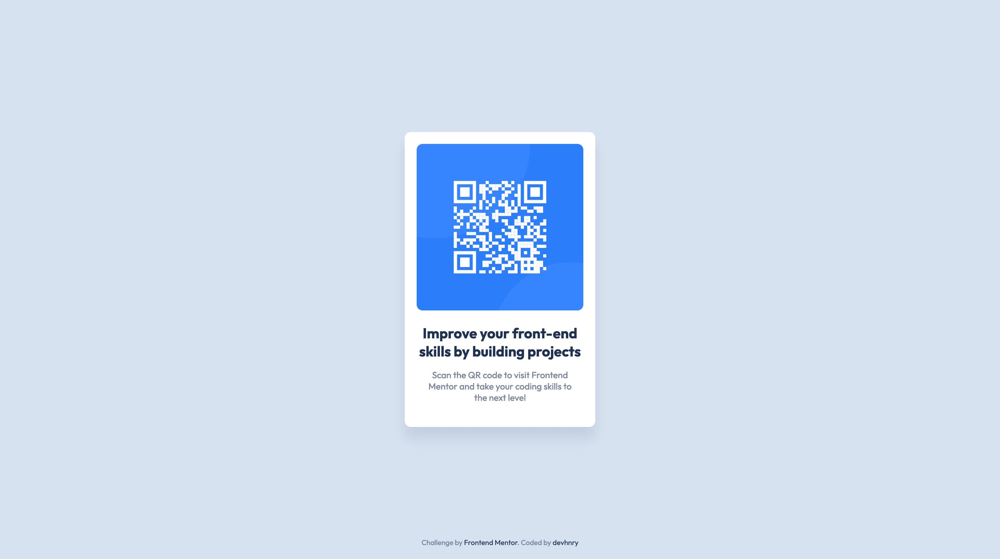

# Frontend Mentor - QR code component solution

This is a solution to the [QR code component challenge on Frontend Mentor](https://www.frontendmentor.io/challenges/qr-code-component-iux_sIO_H). Frontend Mentor challenges help you improve your coding skills by building realistic projects. 




## Table of contents

- [Overview](#overview)
  - [The Challenge]()
  - [Screenshot]()
  - [Links](#links)
- [My process](#my-process)
  - [Built with](#built-with)
- [Author](#author)
- [Acknowledgments](#acknowledgments)

### Links

- Solution URL: [](https://www.frontendmentor.io/solutions/qr-code-component-using-sass-iizmRsrD9s)
- Live Site URL: [](https://devhnry.github.io/qr-code-component-main/)

## My process

### Built with

- Semantic HTML5 markup
- [SASS](https://sass-lang.com/documentation/modules) - SASS Modules

## Author

- Frontend Mentor - [@devhnry](https://www.frontendmentor.io/profile/devhnry)
- Twitter - [@devhnry](https://www.twitter.com/yourusername)


## File structure

```
.
├── assets
│   ├── css
│   │   ├── style.css
│   ├── images
│   │   ├── favicon-32x32.png
│   │   ├── image-qr-code.png
│   │   └── screenshot-qr-code.png
│   └── sass
│       ├── abstract
│       │   ├── _mixins.scss
│       │   └── _variables.scss
│       ├── base
│       │   ├── _base.scss
│       │   └── _typography.scss
│       ├── component
│       │   └── _card.scss
│       ├── layout
│       │   └── _footer.scss
│       ├── pages
│       │   └── _home.scss
│
├── design
│   ├── desktop-design.jpg
│   ├── desktop-preview.jpg
│   ├── mobile-design.jpg
│   └── screenshot.png
│
├── node_modules
├── index.html
├── package-lock.json
├── package.json
└── README.md

```

